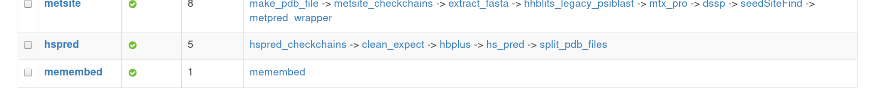
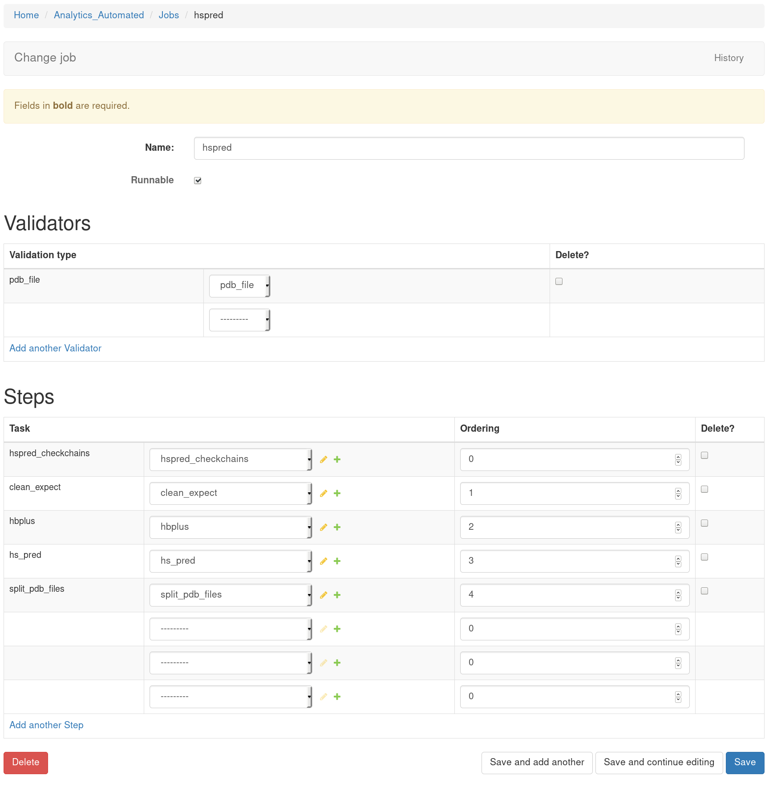
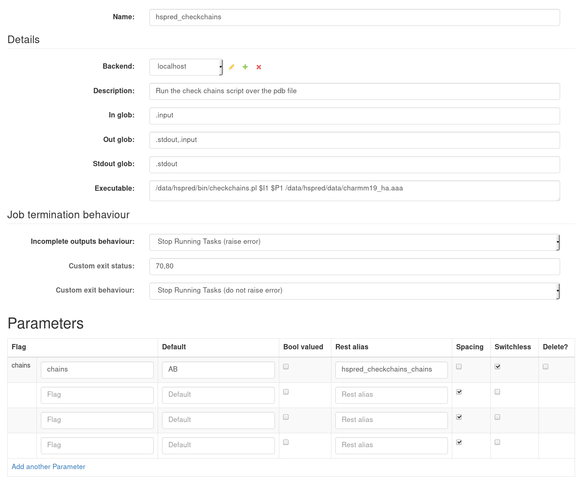
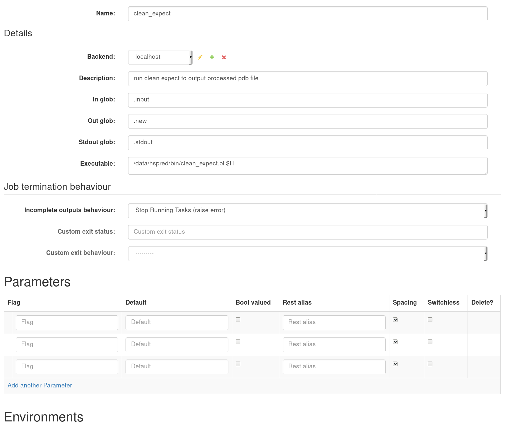
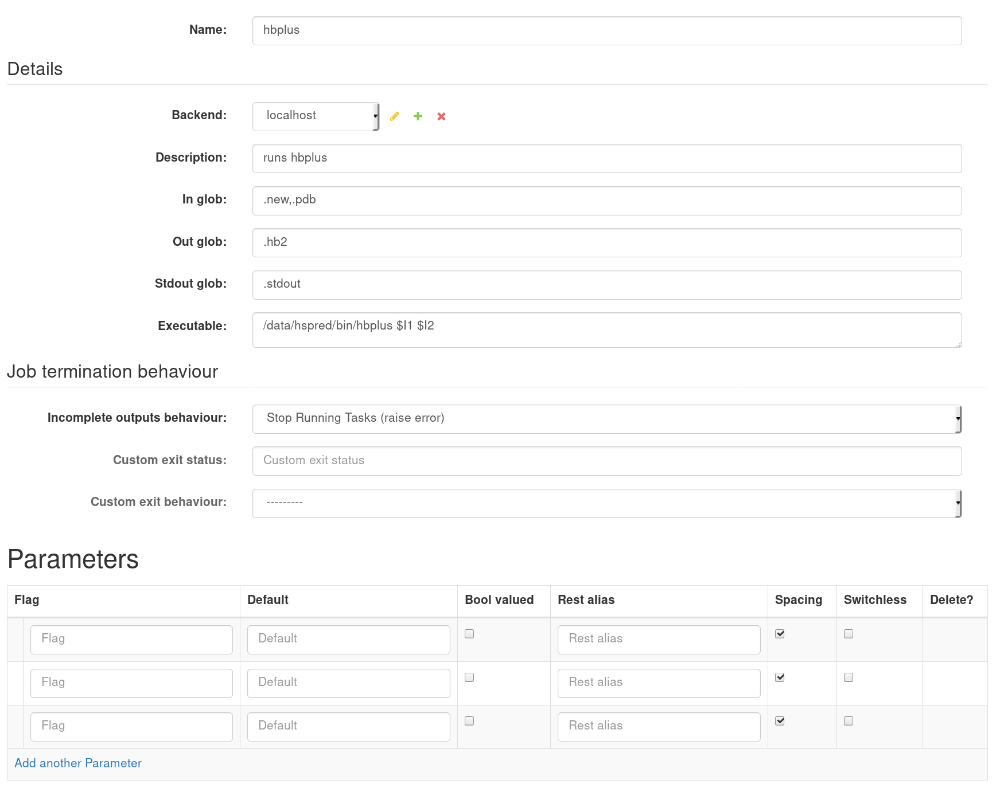
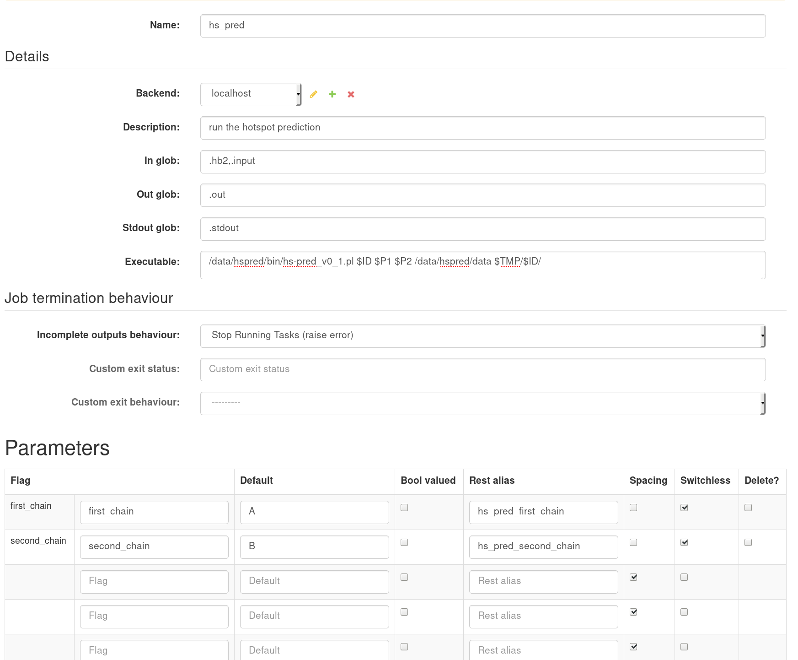
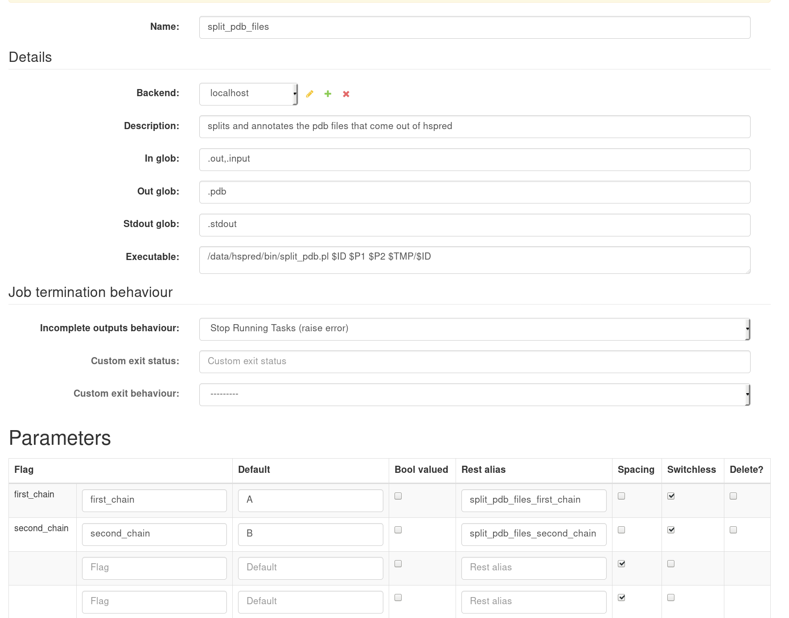
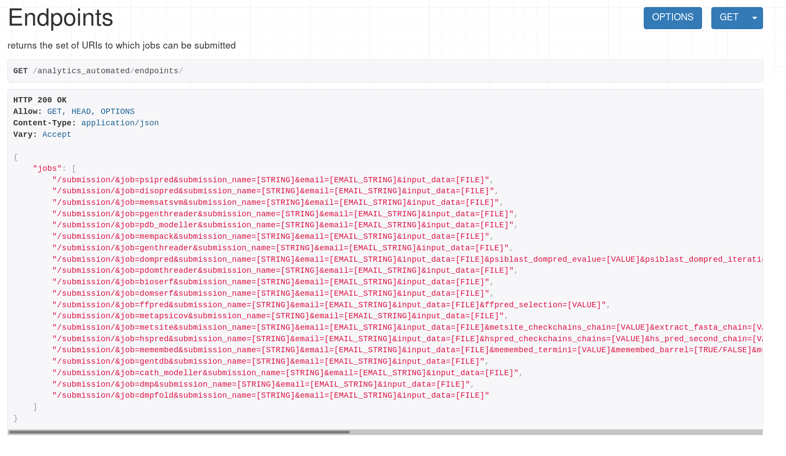

.. _complex_job:

Configuring And Using A Basic Job
=================================

Below we include screenshots of a more complex job configuration. There are
some notes we hope will help you understand a more complex configuration

Job list
^^^^^^^^

http://127.0.0.1:8000/admin/analytics_automated/job/

Note the list of 5 tasks for the job named hspred

hspred Job
^^^^^^^^^^

Clicking the job name takes us to the job configuration. Not the validation type
is 'pdb_file'. This is a custom validation made by adding a new function to
the validators.py code in the Django application.

The job has 5 steps ordered from 0 to 4.

hspred_checkchains Task
^^^^^^^^^^^^^^^^^^^^^^^

The first task runs a piece of code called checkchains.pl. It takes the .input
file specified by $I1, one user parameter $P1 and references a file on the file
system it needs '/data/hspred/data/charmm19_ha.aaa'.

In the Parameters section we list a parameter called chains which the user must
supply when they use REST to submit their job. By default it uses the string
'AB' the user can provide a different string. The http REST call requires the
user use the key  hspred_checkchains_chains. Further details of executable
field syntax can be found at https://pypi.org/project/commandRunner/

In the 'Job termination behaviour' section we specify if the script fails to
produce the correct output then the job should stop and send and error to the
user. The script can produce some non-zero exit statuses, 70 or 80, we specify
that this should stop the data analysis but not return an error. In this case
it is because the script has identified that the incoming data is not valid.

clean_expect Task
^^^^^^^^^^^^^^^^^

The second task runs a script called clean_expect.pl. It takes the user input
and outputs a file called .new

hb_plus Task
^^^^^^^^^^^^

The third task runs a C executable called hbplus. It takes as input files produced
by previous steps. And outputs a file called hb2

hs_pred Task
^^^^^^^^^^^^

The fourth task runs a script called hs-pred_v0_1.pl. It takes two parameters,
$P1 and $P2. These are defined in the Parameters section and need to be
provided by the user using the 'Rest alias' listed.  The executable makes use
of two other special strings $ID and $TMP.  $STMP is the path of the root tmp
directory which is set when you create a Backend (see 'Configuring A Basic Job').
This is the path where the celery works create and delete the files they produce.
$ID is the job id that the Celery workers have for this job. Each job gets a
unique ID which is used to identify files to prevent concurrent jobs colliding
with one another. In this case the script needs as input a file name stub so
we use $ID

split_pdb_files Task
^^^^^^^^^^^^^^^^^^^^

The final task runs the script split_pdb.pl. As before it takes two parameters
the user must supply using the 'Rest alias' names. And it makes use of the $ID
and $TMP special strings

Endpoints
^^^^^^^^^

Now the job is complete we can check the system endpoints at
http://127.0.0.1:8000/analytics_automated/endpoints/

Note the 15th entry is for job=hspred this line indicates the REST URI call
needed for a user to submit to this job and all the fields that are required

    /submission/&job=hspred&submission_name=[STRING]&email=[EMAIL_STRING]&input_data=[FILE]&hspred_checkchains_chains=[VALUE]&hs_pred_second_chain=[VALUE]&hs_pred_first_chain=[VALUE]&split_pdb_files_second_chain=[VALUE]&split_pdb_files_first_chain=[VALUE]",
