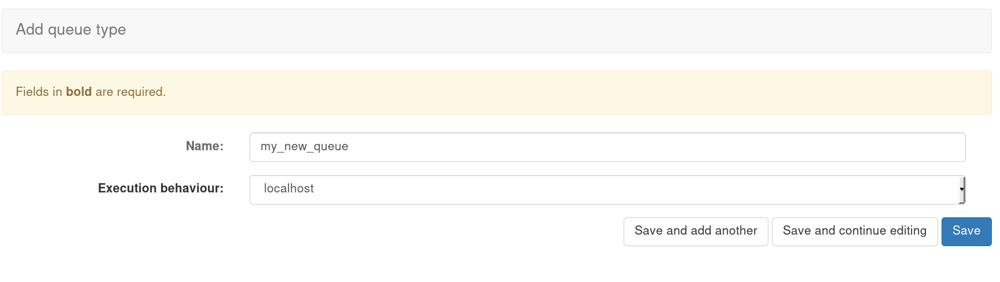
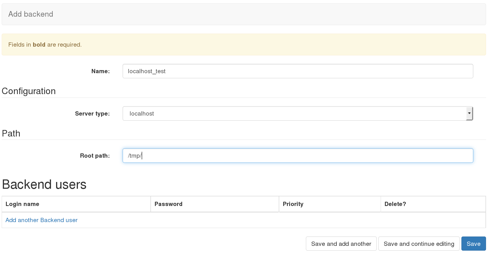
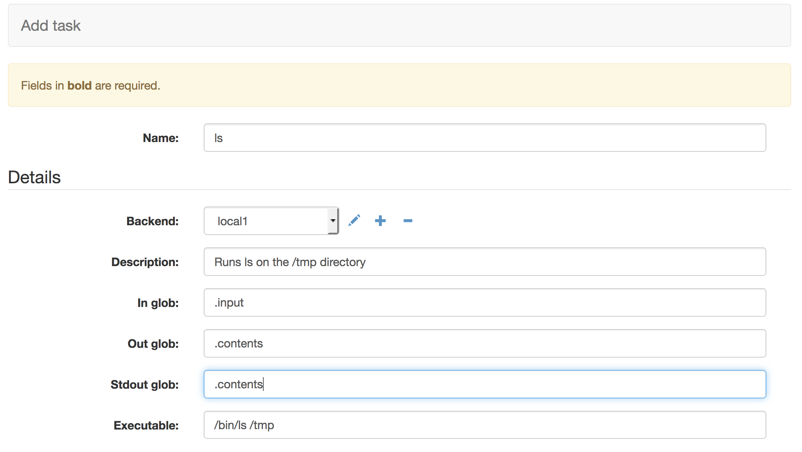
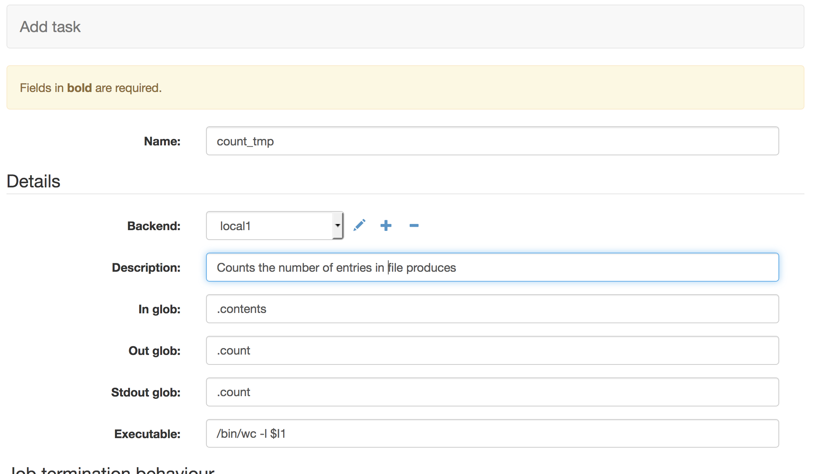
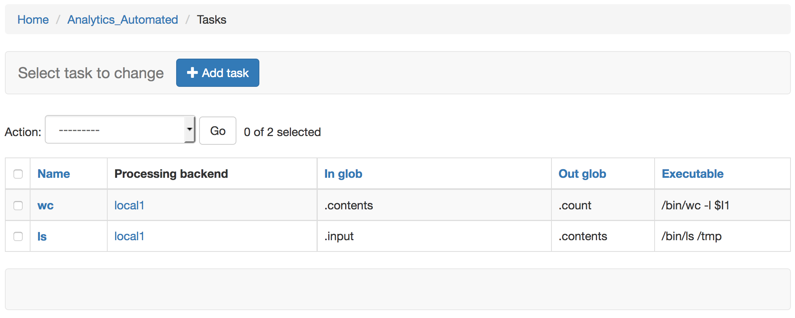
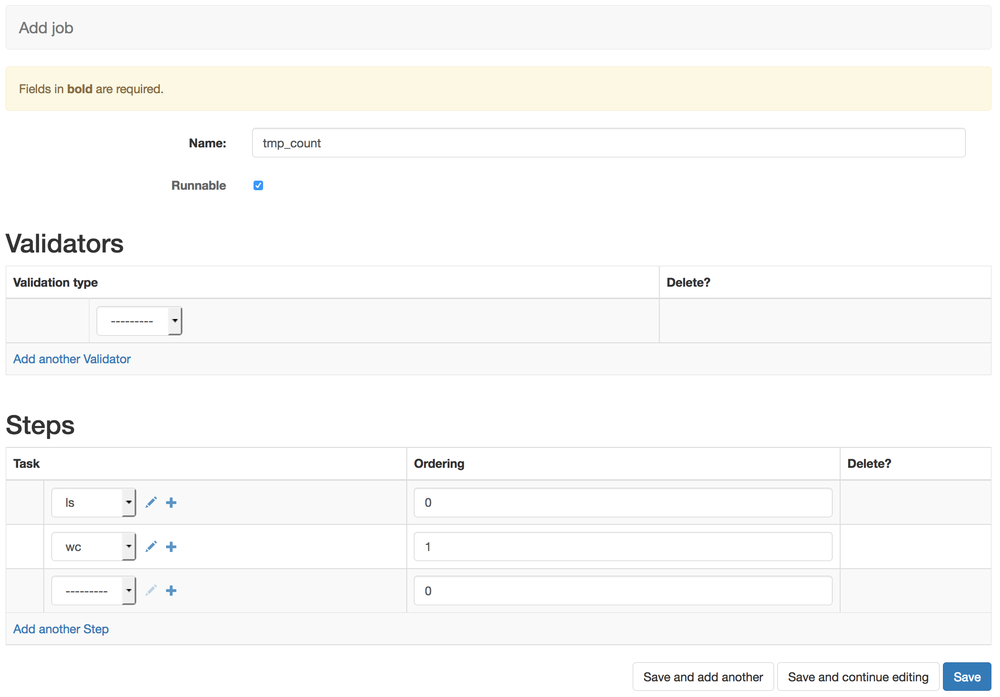

.. _configuring_a_basic_job:

Configuring And Using A Basic Job
=================================

Here we run through configuring a simple job assuming default queue and
validator types. See the admin documentation to configure these.

Queue type
^^^^^^^^^^

First we configure a type of queue. This lets us define a type of Celery
queue and the expected execution behaviour. Add 'localhost' to the Name field
and from the Execution Behaviour drop down select 'localhost'. Then press Save.

There are 4 queue types for different types of execution behaviour. Localhost
will run a command as though you are running a binary from a *nix commandline.
GridEngine will submit a command to a DRMAA compliant grid engine queue if
you have installed and configured this on the machine the workers are running
on. R and Python will run chunks of code in those languages directly.
Task

Backend
^^^^^^^

Next we use the admin interface to navigate to the Backend admin page,
http://127.0.0.1:8000/admin/analytics_automated/backend/.
Then selecting the '+ Add Backend' option we can configure a newtype of backend
We'll configure a new backend called 'local1', with a Queue Type
of 'localhost' and we leave the root path with the default called '/tmp/'.

Hitting save makes this backend configuration available to tasks

When you start the Celery workers the -Q option specifies which of the named
backends the pool of workers is watching. If you add new backends with new names
be sure to stop and restart the workers with the new backend name added

Task
^^^^

With a backend configured we can configure some tasks. Navigate to the Task menu,
http://127.0.0.1:8000/admin/analytics_automated/task/, and select the '+ Add Task' option.

Our first task will run the unix command ls on the /tmp directory. We give it
a name and a useful human readable description. With 'In Glob'
set to .input the data the user provided to the system will be available in a file
ending with the suffix .input. In Glob is a comma separated list of possible prior
input files. This is a requirement if you want a task to be
able to read the input the user submitted. 'Out Glob' specifies the files of
data that should be gathered up after the command runs and made available to
the user. In this case the system will look for a file ending with .contents
after the process runs.

Setting the 'Stdout glob' tells the system to redirect the command's std out
stream into a file ending with '.contents'. In this way the output of the command
is sent to a file ending in .contents and we've told the task to gatther up
such files to make them available to the user. If the task produces many files
we want to capture, we can provide a comma separated list of other suffixes.

If the backend is a GridEngine or localhost queue types then the executable
string is the commandline command that will be executed by the
task with any output sent to stdout. In this case a simple `/bin/ls /tmp`
unix command. Stdout and the captured file will contain the contents of the
/tmp directory

If your backend is a Python or R type you can expand the text area and write
or paste R or Python code.

We are leaving the Job Termination, parameter and environment options blank
in this simple example. These can be adjusted to add commandline parameters or
environment variables a task needs to be set to execute. Parameter settings are not used
by tasks which run R or Python code. Job Termination option allow you to
control whether a failed task should end the job and whether or not the
user should be sent a 'failure email'. At the bottom of the page you can also
record any executable version or database version information for each task.
This information will also be be made available to the user in their job
results. See the 'Advanced' section of the docs for further details.

Click save to make this task available

The second task is a task that can consume the data generated by a previous task
As before we give the task a simple name and a human readable descriptions.
It defines it's 'In Glob' as a file ending with `.contents`. When this task
runs it will search all previous tasks for output files which match this
criteria and use those files as input.  Note if the task needed data from other
 tasks we can provide a comma separated list of suffixes. Once again 'Out glob'
defines the names of files to be captured so the user can access them and
'Stdout glob' is the suffix to use to capture the stdout of our executable string.

The executable string tells the task to run the unix wc command with the -l
switch to count the lines in the files. The $I1 control sequence names a file,
this refers to the 1st file in the 'In glob' field. So in this instance
we are asking the task to run wc -l on a file ending with .contents and then
capture the output in a file ending .count. We would expect the .count file
to now contain the number of lines in the .contents file. Note the a more
detailed description of the 'Executable' syntax and how it works can be
found in the commandRunner documentation at https://pypi.org/project/commandRunner/.
Python, R and executables all work as per the commandRunner syntax.

As before we are leaving the Job Termination, parameter and environment options blank
in this simple example.

If you return to the http://127.0.0.1:8000/admin/analytics_automated/task/ you
can now see a summary of the two tasks available in the system.

One thing to note is that the 'In Glob' setting will look for output files in
all prior completed tasks, not just the immediate task

Job
^^^

Now navigate to the Job Admin page, http://127.0.0.1:8000/admin/analytics_automated/job/,
and select the '+ Add Job'. From here we can configure a job using the tasks that
are available in the system.

Here we've given the job the name tmp_count as we're going to use the previous
tasks to count the number of files present in the /tmp directory. We've selected
the 'Runnable' option. Jobs which are not Runnable will reject user submissions

This job does not rely on user input data so the validator option is left blank.

Under tasks we select the tasks we wish the job to run and use the ordering
to give sequential integer values which define the ordering of the tasks.
0 for our 'ls /tmp > .contents' task and 1 for the 'wc -l .contents' task. When
configuring your own jobs if you have tasks that can run concurrently you
can assign them the same ordering value.

Now you have configured you're first simple job in the system. Clicking save
will make this job live for users

Endpoints
^^^^^^^^^

You can now check http://127.0.0.1:8000/analytics_automated/endpoints/ to
see what jobs and URLS and parameters are available to users.

This list the URI which accepts the job and the required http fields that
must be passed to the system. In this instance a job name ('tmp_count'),
a submission_name (a user selected value), and email address and the input_data
as a file attachment.

Test The Job
^^^^^^^^^^^^

You can now test the job using the example python script in the example_scripts/
directory:

    cd example_scripts
    python send_file.py

If the submission is a success the script should return a json string  which looks like

    {"UUID":"4fbe4f84-f1a5-11e9-b6ae-989096c13ee6","submission_name":"test"}

If you go to the terminal window that your Celery workers are running in you
s hould also be able to confirm that they have executed the 2 tasks. Importantly
the  "EXECUTABLE:" output lines should show you the commands that were executed.
You can also see any runtime errors that crept up here.

You can examine submissions and their run state at
http://127.0.0.1:8000/admin/analytics_automated/submission/

The important columns are Status and 'Last Message' which return some useful
information about the progress of the data analysis Job. If you click on the value
in the 'pk' column you get a more detailed breakdown of the data analysis submission.
This includes all input files, all files generated by the data analysis task and
all messages generated by the celery Tasks

The results can be retrieved programmatically via REST using the UUID that was returned
on success from the send_file.py script. An http GET request to the following
URL gets the results information (use the UUID you saw)

    http://127.0.0.1:8000/analytics_automated/submission/4fbe4f84-f1a5-11e9-b6ae-989096c13ee6

The results data is then available in the json results array. 'data_path' indicates
the URI of a results file (note the addition of the webserver's statis roor) e.g.

    http://127.0.0.1:8000/submissions/4fc1aaf8-f1a5-11e9-b6ae-989096c13ee6.contents
