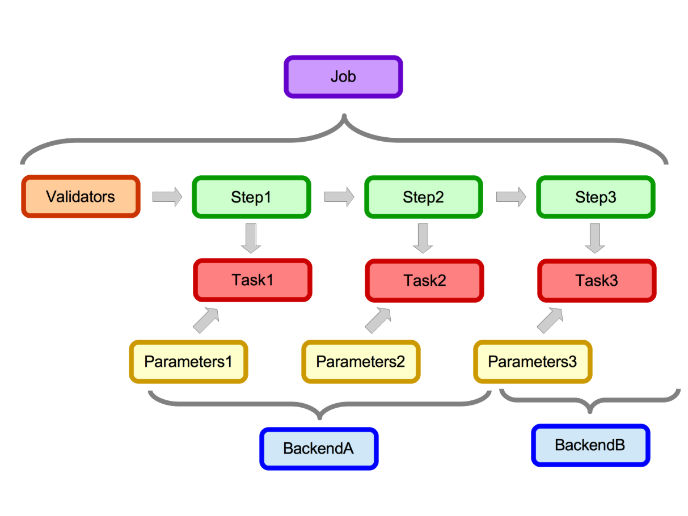

.. _how_it_works:

How The System Works
====================

A_A turns data analysis code in to RESTful webservices for the purpose of building
SOA systems. A_A is made up of 2 main components;

1. A system for configuring data analysis workflows.

2. A system of Celery workers which can receive the data and run those workflows.

A design goal for A_A is to make it agnostic to the technology which executes the
data analysis steps. This will free up analysts and scientists to use the technology
or tool which is most appropriate for any given data transformation or analysis
task.

The other principle design goal is to attempt to transform the problem of turning
data analysis pipelines in to Web Services in to an issue of configuration rather
than coding.

Workflows
---------

In A_A terminology a workflow is known as a **Job**. **Jobs** are made up of sequential
reusable **Tasks**. Each **Task** defines the data analysis it is going to perform
and understands where (on which **Backend**) it is going to run. A task
also understands how it is going to execute. Tasks are run by
`Celery <https://celery.readthedocs.org/en/latest/>`_ workers and the default
execution location (LOCALHOST) is on the machine the worker is running on.

* **Tasks** have **Backends** (a many-to-one relationship)
* **Jobs** have **Steps** (a one-to-many relationship)
* **Jobs** have **Validators** (a one-to-many relationshio)
* **Steps** have **Tasks** (a one-to-one relationship)
* **Tasks** have **Parameters** (a one-to-many relationship)

.. image:: entity_erd.png

Running Jobs
------------

Once a Job is defined it becomes available to users as a RESTful web service.
Users can then send data to that Job for analysis via a simple HTTP POST request to
the A_A server. Everything the user needs to set is validated and if the data is
valid and all config options are supplied the user's data will be passed to the job
queue and a worker will (eventually) run the Job on the data.

Users are returned an ID for their submission and they can use this to poll the
server to establish whether their job has completed.

Data Submission Overview
------------------------

When a user submits data for a **Job** the system receives the data. Runs the
validation and if the validation passes it is all the tasks needed to
calculate the **Job** are pushed to the queue. A celery worker will then pick up
each **Task** in turn interrogate the database for the configuration and then
execute the required code. Once a **Task** is complete any results requested
are pushed in to the results table in the database and the next **Task** (if
there is one) can be executed by a worker

In the job diagram data enters in on the left hand side at the validators.
Data which passes validation then gets passed through each step. Each step has
and attached task which in this example runs on one of 2 backends. Each task
also has it's own stored parameters.
