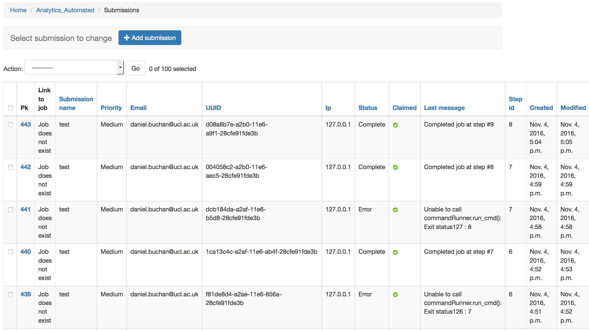

.. _job_admin:

Administration Overview
=======================

As users submit jobs the system keeps track of their progress, any files &
data produced and the current runtime state of the job. There are a number of
pages where you can keep track of this data.

Backends & Tasks & Jobs
^^^^^^^^^^^^^^^^^^^^^^^

::

  http://127.0.0.1:8000/admin/analytics_automated/backend/
  http://127.0.0.1:8000/admin/analytics_automated/task/
  http://127.0.0.1:8000/admin/analytics_automated/job/

These pages allow you to survey exiting backends, tasks and jobs you may have
previously configured. You can also delete and add new entries to these using their admin pages.

See configuring_a_basic_job for how to configure these

Submissions
^^^^^^^^^^^

Probably the most important admin page is the submissions page, http://127.0.0.1:8000/admin/analytics_automated/submission/.
This page keeps a track of all the job requests sent by users, from here you can
also delete submissions and monitor their progress. You can click 'Pk' to see
a full summary of the jobs including all data files produced and all the messages
sent by the workers about the job progress. On the Summary page the most important
fields are 'last message' and 'Status' theses indicate how the job is
progressing. Workers output messages and statuses as the complete or fail tasks
and the 'Last message' shows you the most recent Human readable message about the
job progress. There are 5 statuses

1. SUBMITTED: a job has been submitted by a user but a worker has yet to claimed it
2. RUNNING: job submitted and worker has claimed it
3. COMPLETE: All tasks in the job have been completed and results available
4. ERROR: A task has caught an exception, failed, the job has stopped
5. CRASH: A more critical, uncaught error has happened with the job

For now deleting a submission does not halt the job.

Worker Admin
^^^^^^^^^^^^

The submission Admin gives only an overview of the functioning of the celery workers.
If you require a more fine grained view of their functioning and the ability to
stop running jobs you should install Celery Flower on the machine running redis
