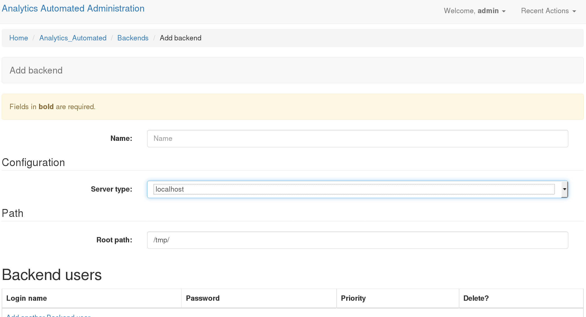
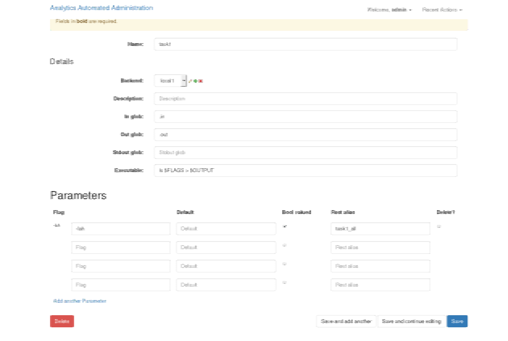
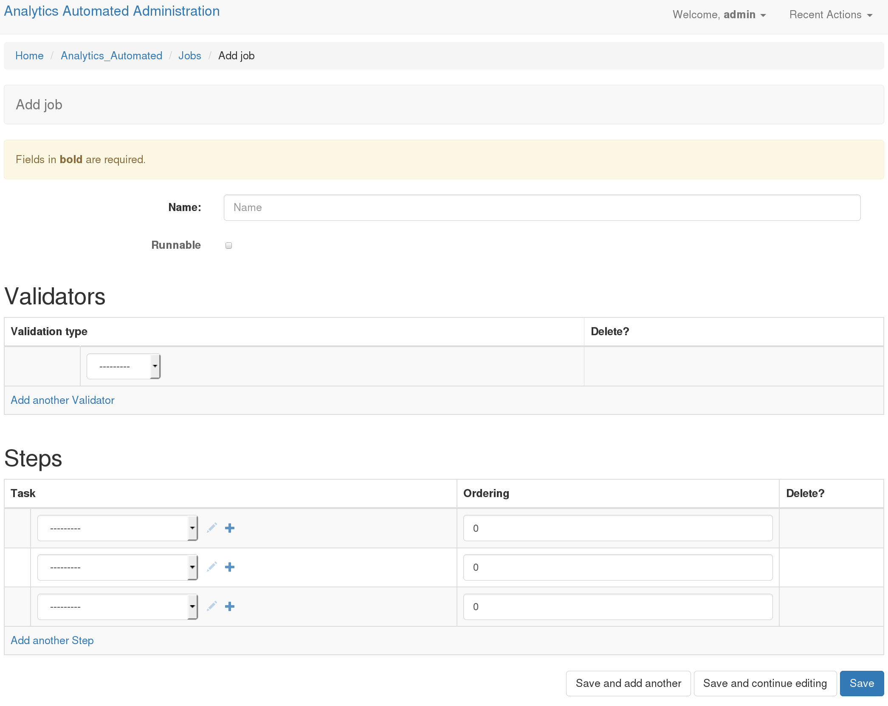

.. _the_Job_UI:

Building Jobs Overview
======================

Configuring jobs is most easily accomplished with the user interface. It is
possible to do this programmatically and the A_A github account comes with a
python script, `populate_analytics_automated.py` which has an example of a simple
job configuration. Additionally it is possible to define jobs using yaml and
upload those to the system

To define a job first you need to define a **Backend** and a series of
**Tasks** and then these **Tasks** can be plugged together as a **Job**.

Assuming you correctly followed the dev installation instructions, you'll need
to log in by pointing your browser at http://127.0.0.1:8000/admin/ and log in
using the superuser details you set during installation.

Define a Backend
----------------

The first thing to do is to define the details for each **Backend** your
tasks will use. A backend is the location where a computational task is
executed. In the most basic configuration you would start only one set of workers
watching only the task queues for the LOCALHOST backend so for this example
we'll only configure one LOCALHOST backend.

In the admin interface click on the Backends option.

**Name**: Gives your backend a useful memorable name

**Server Type**: Tells A_A what kind of execution location this is.
  'localhost': executes the computation on the machine that the celery worker is
  running on
  'GridEngine': uses python DRMAA to submit jobs to a Grid Engine head node running on the same machine the celery work is running on
  'Rserver': This option is not currently supported

**Root Path**: This is a location on a disk (or network drive) which the backend
celery workers can write to and will be used to store temporary files which the
tasks needs on execution

**Backend Users**: You can define a user (user name and passowrd) which the worker
will use to execute the task on backend which support this functionality
(i.e. Hadoop, Grid Engine). This is ignored for other backend types.
**NOTE: LOGGING IN AND USER JOB PRIORITY IS NOT CURRENTLY SUPPORTED IN
THIS VERSION OF A_A**

Defining a Task
---------------

Return to the admin interface at http://127.0.0.1:8000/admin/.
Click on the Tasks link and then select "Add Task".

**Task 1**

**Name**: A useful memorable name for this task. It is convenient if you avoid
using spaces

**Backend**: The backend where this task will run, you'll select from one of
the choices you created previously

**Description**: This allows you to enter a short description of the task.

**In Glob**: A comma separated list of file endings (i.e. .txt, .pdf, etc..)
for files the task will consume. If this task needs to consume data sent
by the user then you must include .input. Internally the system gives each task
a UUID. Each entry in the in glob field causes the system to construct a name
with the following pattern UUID.[ENDING]. Each of these internal names
can be refered to in the Executable field (see below), the first one is called
$I1, the second $I2 and so forth.

**Out Glob**: A comma separated list of file endings (i.e. .txt, .pdf, etc..)
This defines the file endings for all files that will be gathered up and
returned to the database when the task completes. As per the 'In Glob' field
each of these output files creates a name as per UUID.[ENDING] and
these are made available to the Executable fields as $O1, $O2 etc...

**stdout glob**: If you wish to record the task's stdout then you can provide a
file suffix. The task will now perform as though you had used a standard unix
file redirect.

**Executable**: This is the program the worker will execute with any default
flags and options. Using $Ix and $Ox allows you to insert
strings JOB_UUID.[1stInGlob] and JOB_UUID.[1stOutGlob]. You can also refer to
parameters that the user provides (see below) as $Px.

Job termination behaviour
^^^^^^^^^^^^^^^^^^^^^^^^^

If a task fails the default behaviour is to raise an exception, stop the
whole job running and push a message to the user. These options provide
some limited control for other type of behaviour

**Incomplete Outputs Behaviour**: By default the system expect to find at least
one output file with each of the file endings provided in "Out glob". If this
isn't the case then the system will stop future tasks and raise an error.
Alternatively you can, stop running task and not raise an error, or silently
continue on to the next task in the job.

**Custom exit status**: Some tasks will output non zero exits statuses that
are not failure states. You can provided a comma separated list of these
"acceptable" exit status.

**Custom exit behaviour**: If you provide a custom exit status, you must provide
a behaviour. Either when the task detects these values is halts the job throwing an
error, it halts job and doesn't throw and error or it silently continues to the
next task. Note the default behaviour of exit status 0 is to move on to the next
task, if you add 0 to the "Custom exit status" field you can change this default
behaviour

Parameters
^^^^^^^^^^

The task params take one of two forms. Switches which are either present or
absent in the command or valued parameters which may of may not have switches

**Flag**: This string is the value that will be inserted in command if required
each parameter is made available to the executable string as $P[INTEGER],
numbered in order from top to bottom (i.e. $P1, $P2 etc..). Any flag named
'VALUE' is a special case and  a user provided value will be made available in
the executable string as $VALUE

**Default**: This is a default value for the parameter if the Bool Valued is
set to false.

**Bool Valued**: Sets whether this is a boolean flag and therefore whether it
needs a default value

**REST Alias**: This is a short string which identifies this parameter in the
REST call the user makes. The string will have the name of the task prepended to
it in the REST call.

**Spacing**: If the param takes a value (or default) this controls whether
there should be a space between the flat and the value (i.e flat is -t and
value is 12, if true this will be rendered as '-t 12', if false as '-t12')

**Switchless**: Controls whether the flag should be included or just the value
(i.e if true "12", if false '-t 12')

Environments
^^^^^^^^^^^^

Users can set shell environment variables using this form.

**Env**: A string for the name of the environment variable

**Value**: A string for the contents of that environment variable

Executable Syntax
^^^^^^^^^^^^^^^^^
It is worth noting that tasks use the Python package commandRunner to execute
(https://pypi.python.org/pypi/commandRunner/). So it is worth reading those
docs for the API.

The executable line can be any arbitrarily long command line statement even
including ';' and pipes. It must not contain any redirection controls for stdout or
stderr. The system makes available a number of control sequences which can be
inserted in to the executable string.

**IN GLOBS**: These are available in the sequenctial order they appear in
the 'in glob' field as $I1, $I2, $I3 etc...

**OUT GLOBS**: These are available in the sequenctial order they appear in
the 'out glob' field as $O1, $O2, $O3 etc...

**PARAMETERS**: These are available in the sequenctial order they appear in
the 'Parameters' table field as $P1, $P2, $P3 etc...

**TEMPORARY WORKING DIRECTORY**: This path is available as a string using $TMP

**JOB ID**: $ID represents the UUID that the files are named with

**VALUE**: A special parameters called VALUE is made available as $VALUE

Command construction proceeds by first tokenising the Executable string.
Control strings are then interpolated. The following example should explain::

    Job ID: f7a314fe
    Executable: "/usr/bin/example_binary $P1 -u 123 -la $P2 -input $I1 -out $O1"
    Parameter1: "-z"; bool valued False; default 12; spacing True, switchless False
    Parameter2: "-lm" bool valued True
    in_glob: ".input"
    out_glob: ".out, .stdout"
    stdout_glob: ".stdout"

Given these settings the following internal strings will be constructed
$I1: f7a314fe.input
$O1: f7a314fe.out
$O2: f7a314fe.stdout
$P1: "-z 12"
$P2: "-lm"

The final command which will be executed will be equivalent to the following
command line call::

    /usr/bin/example_binary -z 12 -u 123 -la -lm -input f7a314fe.input -out f7a314fe.out > f7a314fe.stdout

Note that if this is the first task in a job the data sent by the user is
made available as a file called [ID].input

Define a Job
------------

Once you have defined one or more tasks you can define a **Job**. Return to
http://127.0.0.1:8000/admin/ and click on Jobs then select "Add Job"

**Name**: A useful name for the job. Users will use this when submitting data
to the API

**Runnable**: Whether the user can POST data and run this job

Validators
^^^^^^^^^^

You can set one or more data validators for the jobs. Validators are blocks
of code that parse the incoming datafile and verify it is the kind of
data the validator checks for. You are free to write your own
validators.

**Validation Type**: Every public function in validators.py is available as an option

Steps
^^^^^

Now you select which tasks will run in which order.

**Tasks**: use the drop down to select from your named tasks

**Ordering**: A numeric value which defines the order the tasks will run in
starting with the lowest value. These need not start from 0 and need not be
strictly consecutive numbers. The system supports limited paralellisation of
tasks. Any task with the same ordering value will run concurrently. It is
up to you to understand task dependency and order your task appropriately.

Using Your Job
--------------

When you have now defined your first job. Users can use it by making a multi-part form
POST request to http://127.0.0.1:8000/analytics_automated/submission and
passing all the correct values.

Users *must* at a minimum pass the following information in

**job**: The name of the job as defined in the **Job** form in this example 'job1'

**submission_name**: A string by which the user will remember thier submission

**email**: An email address (currently required even if A_A is not set to return emails)

The job described above has 2 parameters and values for these must be provided
by the user.

Checking what jobs are available
^^^^^^^^^^^^^^^^^^^^^^^^^^^^^^^^

Once you have defined some jobs the system provides a GET end point, `/endpoints`
which returns a list of all the valid jobs and their required params. You can
access this json at

http://127.0.0.1/endpoints/

Submitting Data
^^^^^^^^^^^^^^^

An example of using the api can be found in the `send_file.py` and
`send_fasta.py` scripts in the example directory.

When a submission is succesful the system returns a blob of json with a UUID.
Calling http://127.0.0.1:8000/analytics_automated/submission/[UUID] with a GET
request will return a json with the current state of the job.
