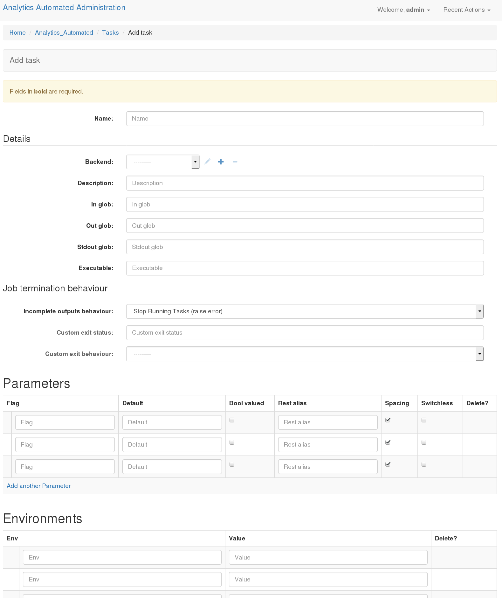
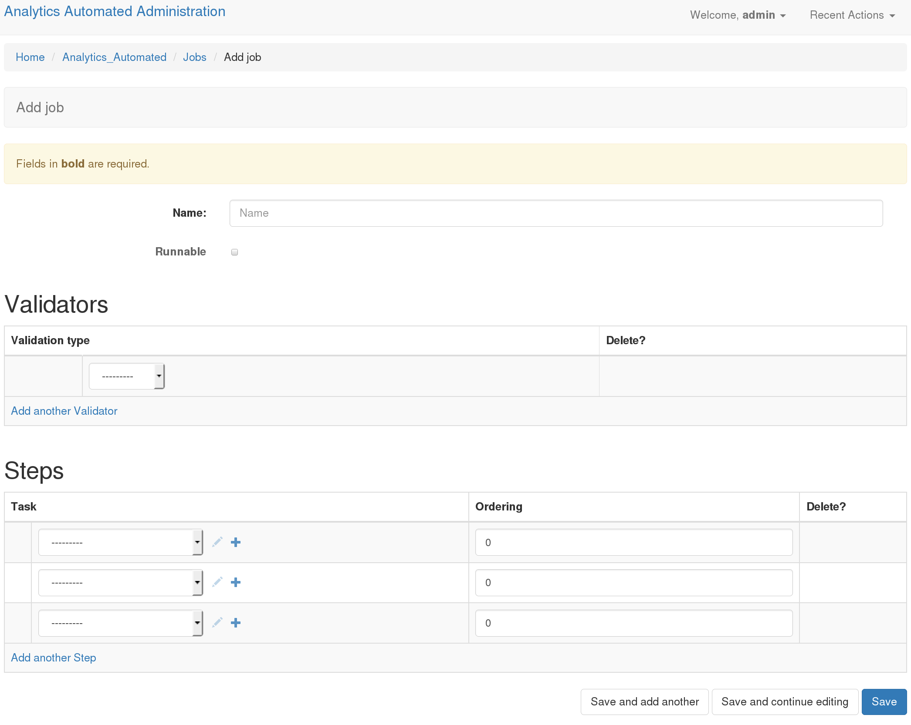

Building Jobs
=============

Configuring jobs is most easily accomplished with the user interface. It is
possible to do this programmatically and the A_A github account comes with a
python script, `populate_analytics_automated.py` which automatically configures
the job we'll walk through here.

First you need to define a **Backend** and a series of **Tasks** and then
these **Tasks** can be plugged together as a **Job**.

You'll need to log in by pointing your browser at http://127.0.0.1:8000/admin/
and log in using the superuser details you set during installation.

Define Backend
--------------

The first thing to do is to define the details for each **Backend** your
tasks will use. In the basic configuration we started only one set of workers
watching only the task queue for the LOCALHOST backend so we'll only configure
one LOCALHOST backend.

In the admin interface click on the Backends option and then click on the
"Add Backend" button. Fill out the form as per the screenshot below

.. image:: backend_config.png

**Name**: Gives your backend a useful memorable name

**Server Type**: Tells A_A what kind of execution location this is

**IP & Port**: When a backend is remote to the worker these details allow the worker
to find the backend on the network. These are not used for the LOCALHOST backend

**Path**: This is a location on a disk (or network drive) which the backend has access to
it will be used to store temporary files which the task needs on execution

**Backend Users**: You can define a user (user name and passowrd) which the worker
will use to execute the task on backend which support this functionality
(i.e. Hadoop, Grid Engine). This is ignored for other backend types.

Define a Task
-------------

Now we define 2 tasks. Return to the admin interface at http://127.0.0.1:8000/admin/.
Click on the Tasks link and then select "Add Task". Fill out the form as below.
We're going to define one task which list the temporary directory and sends the information
to a file. And a second task which will grep that file for certain lines. The output of
the grep will be available to the users.

**Name**: A useful memorable name for this task

**Backend**: The backend where this task will run, as defined above

**In Glob**: If the executable needs to consume an input file the data will be
written to a file with this file ending

**Out Glob**: If the executable needs to output a file the file will be written
to a file with this file ending. Anything contained here will be pushed to the
database for the users to pick up when the task is complete

**Executable**: This is the program the worker will execute.

LOCALHOST Executable Syntax
^^^^^^^^^^^^^^^^^^^^^^^^^^^
The executable line can be any arbitrarily long unix commandline command even
including ';' This is supplemented by a number of control statements which will
be interpolated out.

**$FLAGS**: binary commandline switches i.e. -l

**$OPTIONS**: command line param which take values i.e -n 100

**$INPUT**: The location of an input file using the **In Glob**

**$OUTPUT**: The location of an input file using the **Out Glob**

None of these are required.

.. image:: task2.png

Parameters
^^^^^^^^^^

The task params take one of two forms. Boolean valued (known as flag), or non-boolean
valued.

**Flag**: This is the option which will be interpolated by either the $FLAGS or $OPTIONS control

**Default**: This value is required if the flag in non-boolean

**Bool Valued**: Sets whether this is a boolean flag and therefore whether it needs a default

**REST Alias**: A short string which will identify the user's control of this option when they
call the REST api, i.e one of the POST params the user will need to pass

Define a Job
------------

Now we have some tasks attached to a backend we can define a **Job**. Return to
http://127.0.0.1:8000/admin/ and click on Jobs then select "Add Job"

**Name**: A useful name for the job. Users will use this when submitting data
to the API

**Runnable**: Whether the user can call this job (NOT YET IMPLEMENTED)

Validators
^^^^^^^^^^

You can set one or more data validators for the jobs. Regular expressions will
examine the contents of the incoming file of data to ensure that you they match.

**Validation Type**: This is the type of validation the incoming data must pass
in the :ref:`advanced_uses` tutorial we'll show you how to add custom validators to this dropdown

**Re String**: If you selected 'Regular Expression' validation then you need to provide
a valid python regular expression.

Steps
^^^^^

Now you select which tasks will run in which order.

**Tasks**: use the drop down to select from your named tasks

**Ordering**: A numeric value which defines the order the tasks will run in starting with the lowest
value. These need not start from 0 and need not be consecutive numbers

Using Your Job
--------------

You have now defined your first job. Users can use it by making a multi-part form
POST request to http://127.0.0.1:8000/analytics_automated/submission and
passing all the correct values.

Users *must* at a minimum pass the following information in

**job**: The name of the job as defined in the **Job** form in this example 'job1'

**submission_name**: A string by which the user will remember thier submission

**email**: An email address (currently required even if A_A is not set to return emails)

For the job we defined each task had two params users must pass in values for these.
In this instance these had the REST alias of 'all' and 'number' and are identified
in the HTTP submission by having their task name and an underscore added

**task1_all**: When we defined with Parameter for task1 bool_valued was selected
the calling user must pass in True or False

**task2_number**: When we defined with Parameter for task2 bool_valued was *not*
selected. The user must pass in a string value, typically a number.

Checking what jobs are available
^^^^^^^^^^^^^^^^^^^^^^^^^^^^^^^^

Once you have defined some jobs the system provides a GET end point, `/endpoints`
which returns a list of all the valid jobs and their required params. You can
access this json at

http://YOUR_URI/endpoints/

Submitting Data
^^^^^^^^^^^^^^^

And example of using the api can be found in the `send_file.py` script.

When a submission is succesful the system returns a blob of json with a UUID.
Calling http://127.0.0.1:8000/analytics_automated/submission/[UUID] with a GET
request will return a json with the current state of the job.
